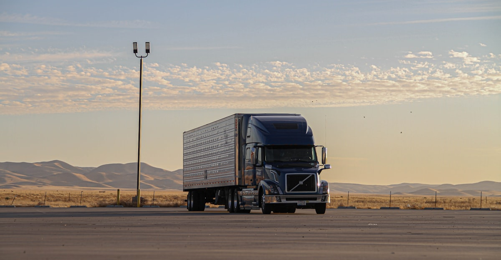
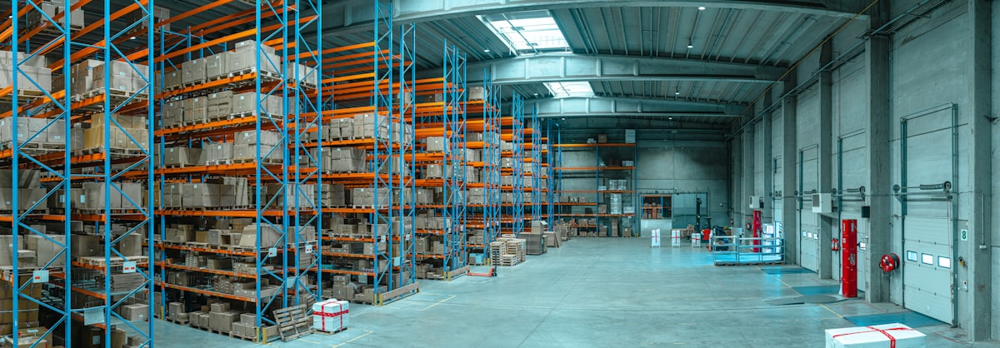
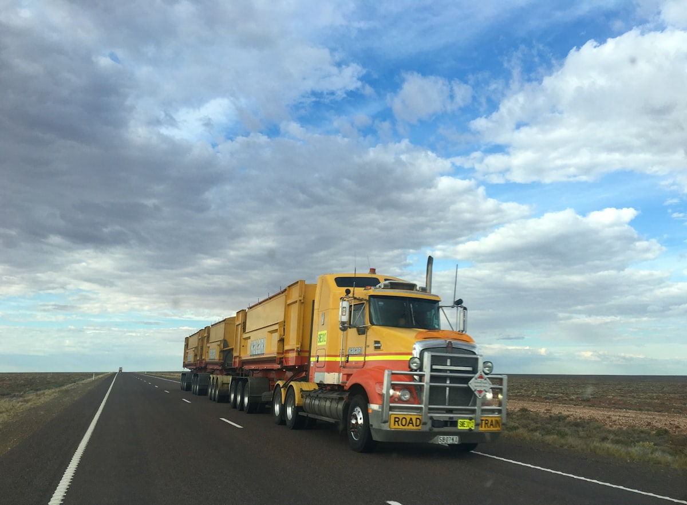
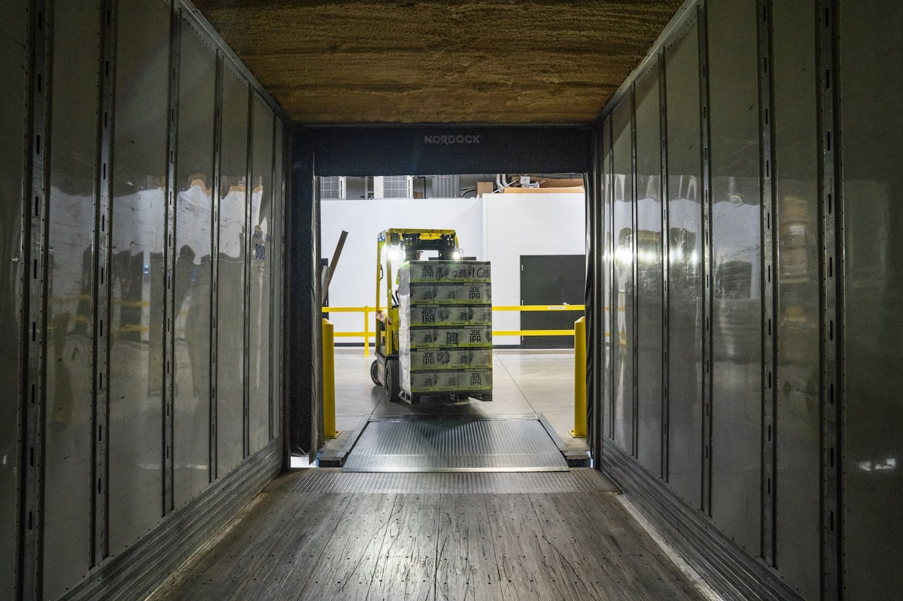
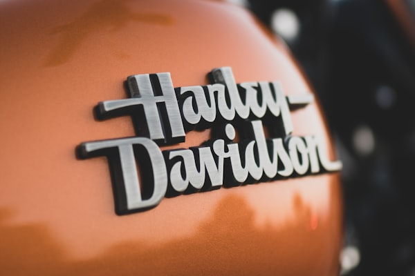

<!DOCTYPE html>
<html>
<head>
  
  <meta charset="UTF-8">
  <meta http-equiv="X-UA-Compatible" content="IE=edge">

  <meta name="viewport" content="width=device-width, initial-scale=1, minimum-scale=1">
  <link rel="shortcut icon" href="assets/images/logo5.png" type="image/x-icon">
  <meta name="description" content="Site sobre empresa de coleta e entrega de produto, visando eficiência, tradição, comprometimento, agilidade, confiança e sua trajetória desde sua criação, internacionalmente.">

  <title>Eficiência Logística Internacional</title>
  <link rel="stylesheet" href="assets/web/assets/Coleta Expressa-icons2/Coleta Expressa2.css">
  <link rel="stylesheet" href="assets/parallax/jarallax.css">
  <link rel="stylesheet" href="assets/bootstrap/css/bootstrap.min.css">
  <link rel="stylesheet" href="assets/bootstrap/css/bootstrap-grid.min.css">
  <link rel="stylesheet" href="assets/bootstrap/css/bootstrap-reboot.min.css">
  <link rel="stylesheet" href="assets/dropdown/css/style.css">
  <link rel="stylesheet" href="assets/socicon/css/styles.css">
  <link rel="stylesheet" href="assets/animatecss/animate.css">
  <link rel="stylesheet" href="assets/theme/css/style.css">
  <link rel="preload" href="https://fonts.googleapis.com/css2?family=Inter+Tight:wght@400;700&display=swap" as="style" onload="this.onload=null;this.rel='stylesheet'">
  <noscript><link rel="stylesheet" href="https://fonts.googleapis.com/css2?family=Inter+Tight:wght@400;700&display=swap"></noscript>
  <link rel="preload" as="style" href="assets/Coleta Expressa/css/additional.css"><link rel="stylesheet" href="assets/Coleta Expressa/css/additional.css" type="text/css">
  
  

  
</head>
<body>

    

<section class="menu menu2 cid-u6tmSNOOP1" once="menu" id="menu-5-u6tmSNOOP1">
  <nav class="navbar navbar-dropdown navbar-fixed-top navbar-expand-lg">
    

      

        
					
				
				
          <a class="navbar-caption text-black display-4" href="https://mobiri.se">Rápido</a>
        
      

      <button class="navbar-toggler" type="button" data-toggle="collapse"
        data-bs-toggle="collapse" data-target="#navbarSupportedContent"
        data-bs-target="#navbarSupportedContent"
        aria-controls="navbarNavAltMarkup" aria-expanded="false"
        aria-label="Toggle navigation">
        

          
          
          
          
        

      </button>
      

        <ul class="navbar-nav nav-dropdown" data-app-modern-menu="true">
          <li class="nav-item">
            <a class="nav-link link text-black display-4" href="#">Eficiência</a>
          </li>
          <li class="nav-item">
            <a class="nav-link link text-black display-4" href="#"
              aria-expanded="false">Tradição</a>
          </li>
          <li class="nav-item">
            <a class="nav-link link text-black display-4" href="#">Agilidade</a>
          </li>
        </ul>
        

          <a class="btn btn-primary display-4" href="https://mobiri.se">Explorar</a>
        

      

    

  </nav>
</section>

    
<section class="header18 cid-u6tmSNOsD5 mbr-fullscreen" data-bg-video="https://www.youtube.com/embed/_U_0RCEPis0?autoplay&#x3D;1&amp;loop&#x3D;1&amp;playlist&#x3D;_U_0RCEPis0&amp;t&#x3D;20&amp;mute&#x3D;1&amp;playsinline&#x3D;1&amp;controls&#x3D;0&amp;showinfo&#x3D;0&amp;autohide&#x3D;1&amp;allowfullscreen&#x3D;true&amp;mode&#x3D;transparent" id="hero-15-u6tmSNOsD5">
  

  

    

      

        <h1
          class="mbr-section-title mbr-fonts-style mbr-white mb-4 display-1 animate__animated animate__delay-1s animate__fadeInUp">
          <strong>Coleta Expressa</strong>
        </h1>
        
Da tradição à entrega global, somos a essência da eficiência e agilidade em coleta e entrega de produtos.

        

          <a class="btn btn-white-outline display-7 animate__animated animate__delay-1s animate__fadeInUp" href="#">Descobrir</a>
        

      

    

  

</section>
    
<section class="article07 cid-u6tmSNOKCR" id="about-us-7-u6tmSNOKCR">
  

    

      

        

          <h3 class="card-title mbr-fonts-style mbr-white mt-3 mb-4 display-2">
            <strong>Nossa Jornada Única</strong>
          </h3>
          

            

              

                

                Nascemos com a missão de revolucionar a logística, crescendo de forma exponencial para alcançar reconhecimento internacional.
                

              

            

            

              

                

                  Cada entrega é um capítulo da nossa história, escrita com comprometimento e paixão pela excelência.
                

              

            

            

              

                

                  Do início humilde ao topo global, nossa tradição é alicerçada na confiança e na busca contínua pela perfeição.
                

              

            

          

        

      

    

  

</section>
    
<section class="people04 cid-u6tmSNPIMZ" id="testimonials-4-u6tmSNPIMZ">
	

		

			

				<h3 class="mbr-section-title mbr-fonts-style align-center mb-0 display-2">
					<strong>Depoimentos</strong>
				</h3>	
			

		

		

			

				

					

						

							Rápidos, confiáveis e sempre superando expectativas. A melhor escolha para entregas urgentes!
						

						

							
						

						<h5 class="card-title mbr-fonts-style display-7">
							<strong>Carlos Silva</strong>
						</h5>
					

				

			

			

				

					

						

							Incrível! Nunca vi tanta eficiência e cuidado em uma empresa de logística. Recomendo sem hesitar!
						

						

							
						

						<h5 class="card-title mbr-fonts-style display-7">
							<strong>Ana Santos</strong>
						</h5>
					

				

			

			

				

					

						

							Eficiência e agilidade excepcionais. Sempre entregam no prazo, mesmo nas situações mais desafiadoras.
						

						

							
						

						<h5 class="card-title mbr-fonts-style display-7">
							<strong>Pedro Oliveira</strong>
						</h5>
					

				

			

		

	

</section>
    
<section class="gallery09 cid-u6tmSNQhWl" id="gallery-9-u6tmSNQhWl">
  

    

      

        

          <h5 class="mbr-section-title mbr-fonts-style mt-0 mb-4 display-2">
            <strong>Exploração Visual</strong>
          </h5>
          <h6 class="mbr-section-subtitle mbr-fonts-style mt-0 mb-4 display-7">
            Descubra nossas operações de ponta, instalações de última geração e entregas bem-sucedidas em todo o mundo.
          </h6>
        

      

      

        

          

            

              
            

          

        

        

          

            

              
            

          

        

        

          

            

              
            

          

        

        

          

            

              
            

          

        

      

    

  

</section>
    
<section class="features10 cid-u6tmSNQeYM" id="metrics-2-u6tmSNQeYM">
  

    

      

        

          

            <h5 class="card-title mbr-fonts-style display-1">
              <strong>Tradição</strong>
            </h5>
            

              História rica
            
            
          

        

      

      

        

          

            <h5 class="card-title mbr-fonts-style display-1">
              <strong>Comprometimento</strong>
            </h5>
            

              Excelência em serviço
            
            
          

        

      

      

        

          

            <h5 class="card-title mbr-fonts-style display-1">
              <strong>Agilidade</strong>
            </h5>
            

              Rápido e eficaz
            
            
          

        

      

    

  

</section>
    
<section class="blog-2 cid-u6tmSNQdyM" id="blog-2-u6tmSNQdyM">
    

        

            

                

                    <h4 class="mbr-section-title mbr-fonts-style align-center mb-0 display-2">
                        <strong>Dicas e Atualizações</strong>
                    </h4>
                

            

        

        

            

                

                    

                        
                    

                    

                        <h5 class="item-title mbr-fonts-style mt-0 mb-3 display-7">
                            Eficiência
                        </h5>
                        <h6 class="item-subtitle mbr-fonts-style mb-3 display-5">
                            <strong>Segredos da Entrega</strong>
                        </h6>

                        

                            <a href="" class="btn item-btn btn-primary display-7">
                                Descubra
                            </a>
                        

                    

                

            

            

                

                    

                        
                    

                    

                        <h5 class="item-title mbr-fonts-style mb-3 mt-0 display-7">
                            Inovação
                        </h5>
                        <h6 class="item-subtitle mbr-fonts-style mb-3 display-5">
                            <strong>Novidades em Logística</strong>
                        </h6>
                        

                            <a href="" class="btn item-btn btn-primary display-7">
                                Descubra
                            </a>
                        

                    

                

            

            

                

                    

                        
                    

                    

                        <h5 class="item-title mbr-fonts-style mb-3 mt-0 display-7">
                            Sucesso
                        </h5>
                        <h6 class="item-subtitle mbr-fonts-style mt-0 mb-3 display-5">
                            <strong>Histórias Inspiradoras</strong>
                        </h6>
                        

                            <a href="" class="btn item-btn btn-primary display-7">
                                Descubra
                            </a>
                        

                    

                

            

            

                

                    

                        
                    

                    

                        <h5 class="item-title mbr-fonts-style mb-3 mt-0 display-7">
                            Eficiência
                        </h5>
                        <h6 class="item-subtitle mbr-fonts-style mt-0 mb-3 display-5">
                            <strong>
                                Otimizando Processos
                            </strong>
                        </h6>

                        

                            <a href="" class="btn item-btn btn-primary display-7">
                                Descubra
                            </a>
                        

                    

                

            

        

    

</section>
    
<section class="list1 cid-u6tmSNQcqA" id="faq-1-u6tmSNQcqA">
	

		

			

				

					

						<h3 class="mbr-section-title mb-2 mbr-fonts-style display-2">
							<strong>Perguntas Frequentes</strong>
						</h3>
					

					

						

							

								<a role="button" class="panel-title collapsed" data-toggle="collapse" data-bs-toggle="collapse" data-core="" href="#collapse1_0" aria-expanded="false" aria-controls="collapse1">
									<h6 class="panel-title-edit mbr-semibold mbr-fonts-style mb-0 display-5">
										Como posso rastrear meu pedido?
									</h6>
									
								</a>
							

							

								

									

										Nosso sistema de rastreamento online permite que você acompanhe seu pedido em tempo real, garantindo total transparência.
									

								

							

						

						

							

								<a role="button" class="panel-title collapsed" data-toggle="collapse" data-bs-toggle="collapse" data-core="" href="#collapse2_0" aria-expanded="false" aria-controls="collapse2">
									<h6 class="panel-title-edit mbr-semibold mbr-fonts-style mb-0 display-5">
										Quais são os prazos de entrega?
									</h6>
									
								</a>
							

							

								

									

										Nossos prazos de entrega variam de acordo com a região, mas sempre priorizamos a rapidez e eficiência em todas as etapas do processo.
									

								

							

						

						

							

								<a role="button" class="panel-title collapsed" data-toggle="collapse" data-bs-toggle="collapse" data-core="" href="#collapse3_0" aria-expanded="false" aria-controls="collapse3">
									<h6 class="panel-title-edit mbr-semibold mbr-fonts-style mb-0 display-5">
										Como posso entrar em contato?
									</h6>
									
								</a>
							

							

								

									

										Estamos disponíveis 24 horas por dia, 7 dias por semana. Você pode nos contatar por telefone, e-mail ou através de nossas redes sociais.
									

								

							

						

						

							

								<a role="button" class="panel-title collapsed" data-toggle="collapse" data-bs-toggle="collapse" data-core="" href="#collapse4_0" aria-expanded="false" aria-controls="collapse4">
									<h6 class="panel-title-edit mbr-semibold mbr-fonts-style mb-0 display-5">
										Vocês realizam entregas internacionais?
									</h6>
									
								</a>
							

							

								

									

										Sim, atendemos clientes em todo o mundo e garantimos a mesma qualidade e agilidade em nossas entregas internacionais.
									

								

							

						

						

							

								<a role="button" class="panel-title collapsed" data-toggle="collapse" data-bs-toggle="collapse" data-core="" href="#collapse5_0" aria-expanded="false" aria-controls="collapse5">
									<h6 class="panel-title-edit mbr-semibold mbr-fonts-style mb-0 display-5">
										Qual é a política de devolução?
									</h6>
									
								</a>
							

							

								

									

										Aceitamos devoluções dentro de um prazo específico e garantimos um processo simples e eficiente para garantir sua satisfação.
									

								

							

						

					

				

			

		

	

</section>
    
<section class="gallery07 cid-u6tmSNQ2SN" id="gallery-16-u6tmSNQ2SN">
  

    

      

        

          <h4 class="mbr-section-title mbr-fonts-style align-center mb-0 display-2">
            <strong>Explorando Nossos Serviços</strong>
          </h4>
        

      

    

    

      

        

          
        

        

          
        

        

          
        

        

          
        

      

    

  

</section>
    
<section class="header14 cid-u6tmSNS9el mbr-parallax-background" id="call-to-action-1-u6tmSNS9el">
	

		

			

				

					

						<h1 class="card-title mbr-fonts-style mb-4 display-1">
							<strong>Descubra o Futuro da Entrega</strong>
						</h1>
						

							<a class="btn btn-primary display-7" href="https://mobiri.se">Explore Agora</a>
						

					

				

			

		

	

</section>
    
<section class="features03 cid-u6tmSNSZwI" id="news-1-u6tmSNSZwI">
	

		

			

				

					<h4 class="mbr-section-title mbr-fonts-style align-center mb-0 display-2">
						<strong>Novidades Incríveis</strong>
					</h4>
				

			

		

		

			

				

					

						
					

					

						<h6 class="item-subtitle mbr-fonts-style mb-3 display-5">
							<strong><a class="text-black fw-bold" href="#">Eficiência em Primeiro Lugar</a></strong>
						</h6>
						
08 de Março

						
Descubra como nossa empresa se destaca pela eficiência na coleta e entrega de produtos.

						
<a href="#" class="btn item-btn btn-primary display-7">Saiba Mais</a>

					

				

			

			

				

					

						
					

					

						<h6 class="item-subtitle mbr-fonts-style mb-3 display-5">
							<strong><a class="text-black fw-bold" href="#">Tradição e Comprometimento</a></strong>
						</h6>
						
08 de Março

						
Conheça nossa história de tradição e comprometimento desde a fundação da empresa.

						
<a href="#" class="btn item-btn btn-primary display-7">Saiba Mais</a>

					

				

			

			

				

					

						
					

					

						<h6 class="item-subtitle mbr-fonts-style mt-0 mb-3 display-5">
							<strong><a class="text-black fw-bold" href="#">Agilidade em Ação</a></strong>
						</h6>
						
08 de Março

						
Saiba como nossa agilidade nos torna líderes no mercado de coleta e entrega de produtos.

						
<a href="#" class="btn item-btn btn-primary display-7">Saiba Mais</a>

					

				

			

			

				

					

						
					

					

						<h6 class="item-subtitle mbr-fonts-style mt-0 mb-3 display-5">
							<strong><a class="text-black fw-bold" href="#">Confiança Inabalável</a></strong>
						</h6>
						
08 de Março

						
Descubra por que somos a escolha confiável para suas necessidades de entrega internacional.

						
<a href="#" class="btn item-btn btn-primary display-7">Saiba Mais</a>

					

				

			

		

	

</section>
    
<section class="header18 cid-u6tmSNSSR3 mbr-fullscreen" data-bg-video="https://www.youtube.com/embed/BqFSHbzSs7U?autoplay&#x3D;1&amp;loop&#x3D;1&amp;playlist&#x3D;BqFSHbzSs7U&amp;t&#x3D;20&amp;mute&#x3D;1&amp;playsinline&#x3D;1&amp;controls&#x3D;0&amp;showinfo&#x3D;0&amp;autohide&#x3D;1&amp;allowfullscreen&#x3D;true&amp;mode&#x3D;transparent" id="video-5-u6tmSNSSR3">
  

  

    

    

  

</section>
    
<section class="people03 cid-u6tmSNSkEB" id="team-1-u6tmSNSkEB">
	

		

			

				

					<h4 class="mbr-section-title mbr-fonts-style align-center mb-0 display-2">
						<strong>Nosso Time</strong>
					</h4>
				

			

		

		

			

				

					

						
					

					

						<h6 class="item-subtitle mbr-fonts-style display-5">
							<strong>Gustavo</strong></h6>
						
CEO

					

				

			

			

				

					

						
					

					

						<h6 class="item-subtitle mbr-fonts-style display-5">
							<strong>Isabela</strong></h6>
						
Gerente de Operações

					

				

			

			

				

					

						
					

					

						<h6 class="item-subtitle mbr-fonts-style display-5">
							<strong>Rafael</strong></h6>
						
Especialista em Logística

					

				

			

      

        

          

            
          

          

            <h6 class="item-subtitle mbr-fonts-style display-5">
              <strong>Carolina</strong>
            </h6>
            
Analista de Qualidade

          

        

      

		

	

</section>
    
<section class="gallery10 cid-u6tmSNSrQu" id="features-69-u6tmSNSrQu">
  

      

        

        

        

        

      
   
  

</section>
    
<section class="image02 cid-u6tmSNSq24 mbr-fullscreen mbr-parallax-background" id="image-13-u6tmSNSq24">
    

        

    

</section>
    
<section class="features03 cid-u6tmSNSVWz" id="clients-3-u6tmSNSVWz">
    

        

            

                

                    <h4 class="mbr-section-title mbr-fonts-style align-center mb-0 display-2">
                        <strong>Parcerias Estratégicas</strong>
                    </h4>
                

            

        

        

            

                

                    

                        
                    

                

            

            

                

                    

                        
                    

                

            

            

                

                    

                        
                    

                

            

            

                

                    

                        
                    

                

            

            

                

                    

                        
                    

                

            

            

                

                    

                        
                    

                

            

        

    

</section>
    
<section class="social4 cid-u6tmSNTcKs" id="follow-us-1-u6tmSNTcKs">
    

        

            

                <h3 class="mbr-section-title align-center mb-5 mbr-fonts-style display-2">
                    <strong>Siga-nos</strong>
                </h3>
                

                    <a class="iconfont-wrapper bg-facebook m-2 " target="_blank" href="#">
                        
                    </a>
                    <a class="iconfont-wrapper bg-twitter m-2" href="#" target="_blank">
                        
                    </a>
                    <a class="iconfont-wrapper bg-instagram m-2" href="#" target="_blank">
                        
                    </a>
                    <a class="iconfont-wrapper bg-tiktok m-2" href="#" target="_blank">
                        
                    </a>                   
                

            

        

    

</section>
    
<section class="form5 cid-u6tmSNT4KS" id="contact-form-3-u6tmSNT4KS">
    

        

            

                

                    <h3 class="mbr-section-title mbr-fonts-style align-center mb-0 display-2">
                        <strong>Entre em Contato</strong>
                    </h3>                    
                

            

        

        

            

                <form action="https://Coleta Expressa.eu/" method="POST" class="mbr-form form-with-styler" data-form-title="Form Name"><input type="hidden" name="email" data-form-email="true" value="">
                    

                        
Thanks for filling out the form!

                        

                            Oops...! some problem!
                        

                    

                    

                        

                            <input type="text" name="name" placeholder="Nome" data-form-field="name" class="form-control" value="" id="name-form02-0">
                        

                        

                            <input type="email" name="email" placeholder="Email" data-form-field="email" class="form-control" value="" id="email-form02-0">
                        

                        

                            <input type="url" name="url" placeholder="Telefone" data-form-field="url" class="form-control" value="" id="url-form5-0">
                        

                        

                            <textarea name="textarea" placeholder="Mensagem" data-form-field="textarea" class="form-control" id="textarea-form02-0"></textarea>
                        

                        
<button type="submit" class="btn btn-primary display-7">Enviar Mensagem</button>

                    

                </form>
            

        

    

</section>
    
<section class="contacts01 cid-u6tmSNTol4" id="contacts-1-u6tmSNTol4">
    

        

            

                

                    <h3 class="mbr-section-title mbr-fonts-style align-center mb-0 display-2">
                        <strong>Contatos Importantes</strong>
                    </h3>
                

            

        

        

            

                

                    

                        <h6 class="card-title mbr-fonts-style mb-3 display-5">
                            <strong>Telefone</strong>
                        </h6>
                        

                            <a href="tel:+55 123 456 789" class="text-black">+55 123 456 789</a>
                        

                    

                

            

            

                

                    

                        <h6 class="card-title mbr-fonts-style mb-3 display-5">
                            <strong>Email</strong>
                        </h6>
                        

                            <a href="mailto:contato@entregasexpress.com" class="text-black">contato@entregasexpress.com</a>
                        

                    

                

            

            

                

                    

                        <h6 class="card-title mbr-fonts-style mb-3 display-5">
                            <strong>Endereço</strong>
                        </h6>
                        

                             Brazil
                        

                    

                

            

            

                

                    

                        <h6 class="card-title mbr-fonts-style mb-3 display-5">
                            <strong>Horário de Funcionamento</strong>
                        </h6>
                        

                            Segunda a Sexta: 8h às 18h
                        

                    

                

            

        

    

</section>
    
<section class="footer2 cid-u6tmSNTcHt" id="footer-5-u6tmSNTcHt">
  

    

      

        

          © 2024 Entregas Express. Todos os direitos reservados.
        

      

      

        

          <ul class="row-links-soc">
            <li class="row-links-soc-item mbr-fonts-style display-7">
              <a href="#" class="text-white">Sobre</a>
            </li>
            <li class="row-links-soc-item mbr-fonts-style display-7">
              <a href="#" class="text-white">Serviços</a>
            </li>
            <li class="row-links-soc-item mbr-fonts-style display-7">
              <a href="#" class="text-white">Blog</a>
            </li>
            <li class="row-links-soc-item mbr-fonts-style display-7">
              <a href="#" class="text-white">Contato</a>
            </li>
          </ul>
        

      

    

  

</section>

  
  
  
  
  
  
  
  
  
  
  
  
</body>
</html>
